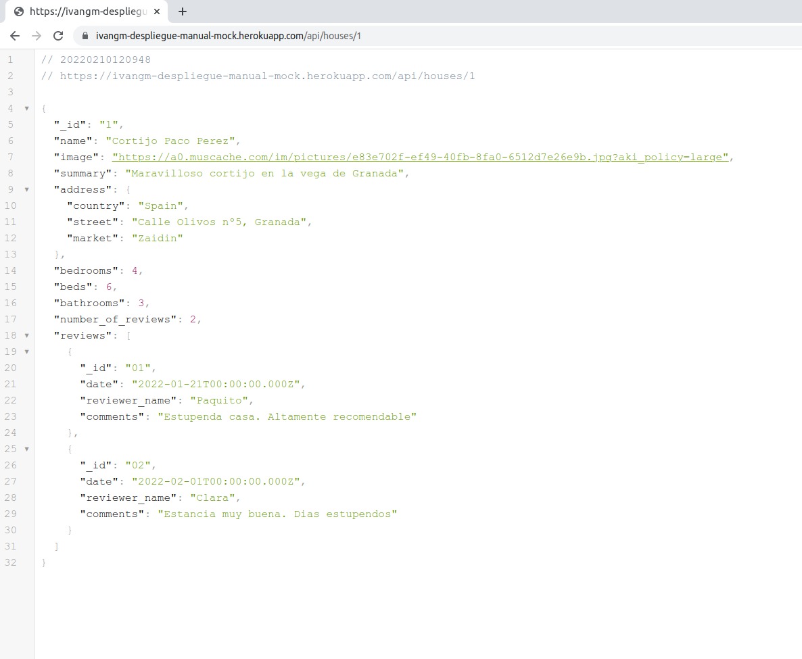

# 01 despliegue-manual-mock

Primero instalo las librerias necesarias para crear correctamente el entorno de produccion que voy a desplegar.

`npm install rimraf cross-env --save-dev`

Actualizo el pckage.json para crear el entorno de producción.

```bash
"clean": "rimraf dist",
"build": "npm run type-check && npm run clean && npm run build:prod",
"build:prod": "cross-env NODE_ENV=production babel src -d dist --extensions \".ts\""
```

Me voy a la página de heroku y creo una nueva aplicación:

  -Creo un buildpack de node.js
  -En setting cojo el Heroku git url para realizar el clonado e ir pusheando los datos que quiera subir:

```bash
    git clone https://git.heroku.com/ivangm-despliegue-manual-mock.git
```

Copio desde la carpeta dist a mi carpeta de clonado los archivos necesarios


Creo un .gitignore y meto el node_modules para evitar que se despliegue. A continuación quito del package.json todo lo innecesario, (Heroku va a instalar todas las dependencias necesarias por si mismo antes lanzar el server).

```bash
{
  "name": "01-config",
  "version": "1.0.0",
  "description": "",
  "main": "index.js",
  "scripts": {
    "start": "node index"

  },
  "keywords": [],
  "author": "",
  "license": "ISC",
  "dependencies": {
    "cors": "^2.8.5",
    "dotenv": "^10.0.0",
    "express": "^4.17.1",
    "mongodb": "^3.6.9",
    "mongoose": "^5.12.12"
  }
}

```

Pusheo los archivos:

```bash
git add .
git commit -m "deploy app"
git push
```

Ahora en Heroku.com me voy a mi app y introduzco las variables de entorno que necesito.


Me voy a "open app" y veo que se ha desplegado correctamente




# 02 despliegue-manual-mongo

Para esta parte me voy a mi cuenta de mongoDB Atlas y creo una nueva base de datos. Inicialmente tengo que crearme un cluster donde irá mi DB.

Escojo AWS como clud provider, Frankfurt como region y Cluster0 como nombre. Creo tambien un usuario para autentificar la conexion.

En network access añado una ip que sera "0.0.0.0/0", es decir accesible desde todas partes.

Ahora copio la MongoDB Connection Uri para cambiar las variables de entorno en mi app.
Pongo ApiMock a false y MONGODB_URI introduzco la mongoUri que obtengo de mi cluster/connect/connect your aplication, elijo node.js como driver y me dan la url necesaria para conectarme.

Para insertar los datos en MongoDB Atlas, creo un console-runner para que recoja los datos de casas que quiero introducir y seguidamente me conecte a mi base de datos de MongoDB Atlas y vuelque el contenido:

```bash
import { disconnect } from 'mongoose';
import { connectToDBServer } from 'core/servers';
import { envConstants } from 'core/constants';
import { houseContext } from 'dals/house/house.context';

export const run = async () => {

  await connectToDBServer('mongodb://localhost:27017/houses');

  const houseList = await houseContext.find().limit(25).lean();

  await disconnect();
   await connectToDBServer(envConstants.MONGODB_URI);
   for (const house of houseList) {

     await houseContext.insertMany({
       ...house,
    });
   }
   await disconnect();
};
```

Efectivamente, si me voy a mi cluster0, veo que se ha creado la base de datos correctamente con los 25 documentos que le indiqué con el "limit(25)".


# 02 despliegue-automatico


Para este apartado, parto de mi aplicacion donde voy a crear un nuevo repositorio github para pushear todo mi codigo y configurar para que actualice mi desplieque de heroku cada vez que haga un push en la rama que indique.

Primeramente me voy a la web de heroku y creo una nueva app. Elijo el nombre "ivang-despliegue-automatico" y en variables de entorno solamente introduzco el mongodb_uri con la uri de mi base de datos de mongodb atlas creada en el apartado anterior.


Todas las demas variables de entorno las pasaré luego con mi archivo Dockerfile.

Ahora me voy a mi cuenta de github y creo un repositorio nuevo "https://github.com/ivangmartin/house-store".

En mi terminal lanzo los siguientes comandos:

```bash
git init
git remote add origin https://github.com/ivangmartin/house-store
git add .
git commit -m "initial commit"
git push -u origin main
```

Con ello subo a mi repositorio todos los archivos de mi app local y lo hago a traves de la rama "main".

Para conectar mi repositorio de github con mi app en heroku necesito un token. Para generarlo hago login en heroku y pido el token:


Con ese token me voy a mis settings de mi repo de github y lo voy a guardar como action secret. 


Tambien me creo un secreto para guardar el nombre de mi app de heroku "HEROKU_APP_NAME" que ahora usaré en mi Github Actions.

Creo .github/workflows/cd.yml con el siguiente código:

```bash
name: Continuos Deployment Workflow

on:
  push:
    branches:
      - main

env:
  HEROKU_API_KEY: ${{ secrets.HEROKU_API_KEY }}
  IMAGE_NAME: registry.heroku.com/${{ secrets.HEROKU_APP_NAME }}/web

jobs:
  cd:
    runs-on: ubuntu-latest
    steps:
      - name: Checkout repository
        uses: actions/checkout@v2
      - name: Login heroku app Docker registry
        run: heroku container:login
      - name: Build docker image
        run: docker build -t ${{ env.IMAGE_NAME }} .
      - name: Deploy docker image
        run: docker push ${{ env.IMAGE_NAME }}
      - name: Release
        run: heroku container:release web -a ${{ secrets.HEROKU_APP_NAME }}
```

Y por último configuro mi Dockerfile y .dockerignore correctamente.

Dockerfile:

```bash
FROM node:14-alpine AS base
RUN mkdir -p /usr/app
WORKDIR /usr/app

# Build back app
FROM base AS back-build
COPY ./ ./
RUN npm install
RUN npm run build

# Release
FROM base AS release
COPY --from=back-build /usr/app/dist ./
COPY ./package.json ./
COPY ./package-lock.json ./
RUN npm ci --only=production

ENV NODE_ENV=production
ENV STATIC_FILES_PATH=./public
ENV API_MOCK=false
ENV CORS_ORIGIN=*

ENTRYPOINT ["node", "index"]
```

.dockerignore:

```bash
node_modules
dist
mongo-data
.editorconfig
.env
.env.example
.env.test
.gitignore
create-dev-env.sh
docker-compose.yml
globalConfig.json
```

Por último pusheo todos los cambios realizados y me voy a mi repositorio de github, selecciono el apartado Actions y veo los workflows que tengo. Se puede ver el como se va haciendo todo el proceso de crear y lanzar la app y cuando acaba, si todo ha ido bien debria quedar algo como lo siguiente:


Ahora me voy a mi app en heroku y veo como automáticamente se realiza un nuevo deploy.


Ahora abro mi app y efectivamente todo funciona. Las siguientes imágenes muestran que la app funciona correctamente en la direccion https://ivang-despliegue-automatico.herokuapp.com/.


La parte opcional no la he realizado porque AWS no es gratuita.
